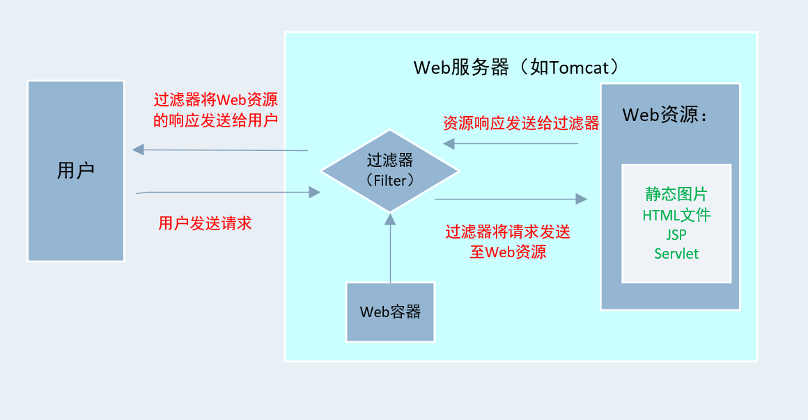

先学知识

- web容器
- web服务器
- web资源
- web应用程序
- 应用程序服务器（应用服务器）
- HTTP 服务器

### 一、Filter简介

Filter，称之为过滤器



### 二、Filter是如何实现拦截的

#### 1、Filter开发步骤

**Filter的开发一般有两个步骤**

>- 编写Java类实现Filter接口，并重写doFilter()方法。
>- 在web.xml文件中使用<filter>和<filter-mapping>元素对编写的Filter进行注册，并设置Filter所能拦截的资源


**FIlter的三种典型应用**

>- 可以filter中根据条件判断是否调用chain.doFilter(request,response)方法，即是否让目标资源执行
>- 在让目标资源执行之前，对request和/response做预处理，再让目标资源执行
>- 在目标资源执行之后，捕获目标资源的执行结果，从而实现一些特殊的功能

- 案例

```java
package com.alexanderbai.filter;

import javax.servlet.*;
import javax.servlet.annotation.WebFilter;
import java.io.IOException;

/**
 * @Author AlexanderBai
 * @data 2019/3/29 21:17
 */
@WebFilter(filterName = "FilterDemo01")
public class FilterDemo01 implements Filter {

    public void init(FilterConfig config) throws ServletException {
        System.out.println("----过滤器初始化-----");
    }

    public void doFilter(ServletRequest req, ServletResponse resp, FilterChain chain)
            throws ServletException, IOException {
        //对request和response做一些预处理
        req.setCharacterEncoding("utf-8");
        resp.setCharacterEncoding("utf-8");
        resp.setContentType("text/html,charset=utf-8");

        System.out.println("req.getLocalPort() = " + req.getLocalPort());
        System.out.println("req.getLocalAddr() = " + req.getLocalAddr());
        System.out.println("req.getLocalName() = " + req.getLocalName());
        System.out.println("req.getRemoteAddr() = " + req.getRemoteAddr());


        System.out.println("Filter执行前！！！");
        chain.doFilter(req,resp);
        System.out.println("Filter执行后！！！");
    }

    public void destroy() {
        System.out.println("----过滤器被销毁-----");
    }
}
```

```java
<?xml version="1.0" encoding="UTF-8"?>
<web-app xmlns="http://xmlns.jcp.org/xml/ns/javaee"
         xmlns:xsi="http://www.w3.org/2001/XMLSchema-instance"
         xsi:schemaLocation="http://xmlns.jcp.org/xml/ns/javaee http://xmlns.jcp.org/xml/ns/javaee/web-app_4_0.xsd"
         version="4.0">

    <!-- 过滤器配置-->
    <filter>
        <filter-name>FilterDemo01</filter-name>
        <filter-class>com.alexanderbai.filter.FilterDemo01</filter-class>
    </filter>
    <filter-mapping>
        <filter-name>FilterDemo01</filter-name>
        <!-- " /* "表示拦截所有的请求-->
        <url-pattern>/*</url-pattern>
    </filter-mapping>

</web-app>
```

####2、Filter链


- 在web服务器中可以开发多个过滤器，这些过滤器组合在一起称为Filter链

- web服务器根据Filter在web.xml中注册的顺序，决定先调用哪一个Filter。

- 当第一个Filter的doFilter()方法被调用时，web服务器会创建一个代表Filter链的FilterChain对传给象该方法。在doFilter()方法中如果调用了Filter的doFilter()方法，则服务器会检查是否还有Filter，如果有则调用第二个Filter，如果没有则调用目标资源。

  ```java
   public void doFilter(ServletRequest req, ServletResponse resp, FilterChain chain)
              throws ServletException, IOException {
        
          chain.doFilter(req,resp);
  
      }
  ```

  

### 三、Filter开发入门


### 四、FIlter的生命周期


### 五、Filter的部署


