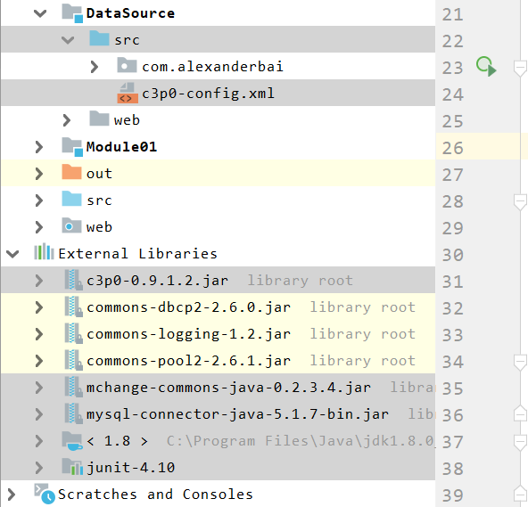
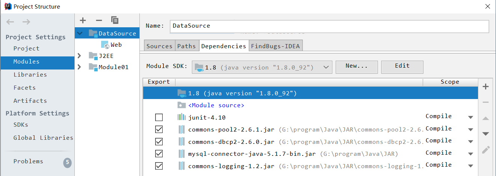

### 一、传统的数据库连接方式

以**MVC设计模式**为例


- 用户每一次请求模型层都要惊醒数据库的连接一个销毁操作
  - 1、加载驱动
  - 2、连接数据库
  - 3、执行SQL语句
  - 4、断开连接
  - **数据库创建连接需要较大的资源，消耗的时间也较长，所以当请求较多时频繁创建连接已不再合理，而且也可能造成数据库内存溢出。**

### 二、数据库连接池的概念

####1、数据库连接池的基本概念

- 提供一个装有已创建好的连接的容器-**数据库连接池**。

  

- 可以对其进行部分初始化参数配置，主要包括
  - **最小连接数：**连接池中含有的最小连接数，所以请求较少时，资源浪费比较严重
  - **最大连接数：**是连接池能申请的最大连接数，当请求过多时，后面的请求将会被加入到等待队列中，影响这次请求对数据库的操作。
  - **最小连接数与最大连接数相差较大时：**最先连接请求将会获得连接池中的连接，超过连接池的最小连接数之后的请求等价于创建一个新的连接，该连接使用 完之后不会立即被销毁，而是被放入连接池中，实现动态扩充连接池。  
- 数据库连接池中出含有已创建的连接外，还可以**动态地创建连接**。

#### 2、编写数据库连接池

- **编写数据库连接池要实现java.sql.DataSource接口**。DataSource接口中定义了两个重载的方法
  - Connection getConnection()
  - Connection getConnection(String username,String password)

- 实现DataSource，并实现连接池功能的步骤

  - 1、在DataSource构造函数中批量创建与数据库的连接，并把创建的连接加入的集合对象中（LinkedList）
  - 2、实现getConnection()方法，让getConnection()方法每次调用时，从LinkedList中去一个连接给用户
  - 3、当使用完Connection后调用Connection.close()方法，Connection对象应保证自己回到LinkedList中，而不是还给数据库。

#####(1)、核心代码

  - 读取数据库的配置文件信息

  > ```java
  > properties.load(JdbcPool.class.getResourceAsStream("db.properties"));
  > ```
  >
  > **等价于**
  >
  > ```java
  > InputStream inputStream= JdbcPool.class.getResourceAsStream("db.properties");
  > properties.load(inputStream);
  > ```
  >
  > - ```java
  >   //使用反射获得Class实例
  >   JdbcPool.class
  >    //通过getClassLoader()方法返回类的加载类 
  >    //Returns the class loader for the class 
  >   public ClassLoader getClassLoader() 
  >    //返回指定资源的输入流 Returns an input stream for reading the 					//specified resource.
  >    public InputStream getResourceAsStream(String name) 
  >   ```
  >
  > ```java
  > //读取输入流，输入流是一种面向行的格式
  > /*Reads a property list (key and element pairs) from the input
  >      * byte stream. The input stream is in a simple line-oriented
  >      * format as specified in*/
  >    public synchronized void load(InputStream inStream) throws IOException
  > ```

  - 使用动态代理技术构件连接池中的Connection

  > ```java
  > @Override
  > public Connection getConnection() throws SQLException {
  > if (listConnections.size() > 0) {
  >    final Connection connection = listConnections.removeFirst();
  >    System.out.println("listConnections数据库连接池大小为：" + listConnections.size());
  >    //返回Connection对象的代理对象
  >    return (Connection) Proxy.newProxyInstance(JdbcPool.class.getClassLoader(), new Class[]{Connection.class}, new InvocationHandler() {
  >        @Override
  >        public Object invoke(Object proxy, Method method, Object[] args) throws Throwable {
  >            if (!method.getName().equals("close")) {
  >                return method.invoke(connection, args);
  >            } else {
  >                listConnections.add(connection);
  >                System.out.println(connection + "被还给listConnections数据库连接池了！！！");
  >                System.out.println("listConnections数据库连接池大小为：" + listConnections.size());
  >            }
  >            return null;
  >        }
  >    });
  > } else {
  >    throw new RuntimeException("对不起，数据库忙！！！");
  > }
  > }
  > ```
  >
  > - **Proxy类：**
  >
  > ```java
  > /*provides static methods for creating dynamic proxy
  >   * classes and instances, and it is also the superclass of all
  >   * dynamic proxy classes created by those methods.
  > 提供了动态代理类和实例的方法，它也是有这些方法小行家的所有动态代理类的超类
  > */
  > ```
  >
  > - ```java
  >   /**
  >       * Returns an instance of a proxy class for the specified interfaces
  >       * that dispatches method invocations to the specified invocation
  >       * handler.
  >   *返回指定接口的代理类的实例，该接口将方法调用分派给指定的调用处理程序。 
  >       * @param   loader        the class loader to define the proxy class
  >   *类加载器来定义代理类 
  >       * @param   interfaces       the list of interfaces for the proxy class
  >       *          to implement 代理类实现的接口列表 
  >       * @param   h  		the invocation handler to dispatch method 			 *invocations to 调度方法调用的调用处理函数 
  >   **/
  >   public static Object newProxyInstance(ClassLoader loader,
  >                                    Class<?>[] interfaces,
  >                                    InvocationHandler h)
  >   ```
  > ```java
  > package java.lang.reflect;
  > 
  > /**
  >    * is the interface implemented by
  >    * the <i>invocation handler of a proxy instance.
  > */
  > public interface InvocationHandler {
  > 
  > /**
  >        * Processes a method invocation on a proxy instance and returns
  >        * the result.  This method will be invoked on an invocation handler
  >        * when a method is invoked on a proxy instance that it is
  >        * associated with.
  > *
  >        * @param   proxy the proxy instance that the method was invoked on
  > *
  >        * @param   method the {@code Method} instance corresponding to
  >        * the interface method invoked on the proxy instance.  The declaring
  >        * class of the {@code Method} object will be the interface that
  >        * the method was declared in, which may be a superinterface of the
  >        * proxy interface that the proxy class inherits the method through.
  > *
  >        * @param   args an array of objects containing the values of the
  >        * arguments passed in the method invocation on the proxy instance,
  >        * or {@code null} if interface method takes no arguments.
  >        * Arguments of primitive types are wrapped in instances of the
  >        * appropriate primitive wrapper class
  > *
  >        * @return  the value to return from the method invocation on the
  >        * proxy instance.  If the declared return type of the interface
  >        * method is a primitive type, then the value returned by
  >        * this method must be an instance of the corresponding primitive
  >        * wrapper class; otherwise, it must be a type assignable to the
  >        * declared return type.  If the value returned by this method is
  >        * {@code null} and the interface method's return type is
  >        * primitive, then a {@code NullPointerException} will be
  >        * thrown by the method invocation on the proxy instance.  If the
  >        * value returned by this method is otherwise not compatible with
  >        * the interface method's declared return type as described above,
  >        * a {@code ClassCastException} will be thrown by the method
  >        * invocation on the proxy instance. 
  > */
  > public Object invoke(Object proxy, Method method, Object[] args)
  >  throws Throwable;
  > }
  > ```

  #####(2)、具体实现

> - **db.properties**
>
>   ```properties
>   driver=com.mysql.jdbc.Driver
>   url=jdbc:mysql://localhost:3306/scott
>   userName=root
>   password=ROOT
>   
>   jdbcPoolInitSize=10
>   ```
>
> - **JdbcPool.java**
>
>   ```java
>   package com.alexanderbai.dbpool;
>   
>   import javax.sql.DataSource;
>   import java.io.IOException;
>   import java.io.InputStream;
>   import java.io.PrintWriter;
>   import java.lang.reflect.InvocationHandler;
>   import java.lang.reflect.Method;
>   import java.lang.reflect.Proxy;
>   import java.sql.Connection;
>   import java.sql.DriverManager;
>   import java.sql.SQLException;
>   import java.sql.SQLFeatureNotSupportedException;
>   import java.util.LinkedList;
>   import java.util.Properties;
>   import java.util.logging.Logger;
>   
>   /**
>    * @Author AlexanderBai
>    * @data 2019/3/28 20:47
>    */
>   public class JdbcPool implements DataSource {
>   
>       private static LinkedList<Connection> listConnections = new LinkedList<>();
>   
>       //在静态块中就加载db.properties数据库配置文件
>       static{
>           Properties properties = new Properties();
>           InputStream inputStream= JdbcPool.class.getResourceAsStream("db.properties");
>           try {
>               properties.load(inputStream);
>           } catch (IOException e) {
>               e.printStackTrace();
>           }
>   
>           try {
>               //properties.load(JdbcPool.class.getClassLoader().getResourceAsStream("db.properties"));
>   
>               String driver = properties.getProperty("driver");
>               String url = properties.getProperty("url");
>               String userName= properties.getProperty("userName");
>               String password = properties.getProperty("password");
>               //初始化数据库连接池连接数大小
>               Integer jdbcPoolInitSize= Integer.valueOf(properties.getProperty("jdbcPoolInitSize"));
>   
>               Class.forName(driver);
>               for (int i = 0; i < jdbcPoolInitSize; i++) {
>                   System.out.println("获取了连接");
>                   Connection connection=DriverManager.getConnection(url, userName, password);
>                   //将获取的连接加入到listConnections集合中，listCOnnections集合就是一个存放数据库连接的连接池
>                   listConnections.add(connection);
>               }
>           } catch (ClassNotFoundException e) {
>               e.printStackTrace();
>           } catch (SQLException e) {
>               e.printStackTrace();
>           }
>       }
>   
>       @Override
>       public Connection getConnection() throws SQLException {
>           if (listConnections.size() > 0) {
>               final Connection connection = listConnections.removeFirst();
>               System.out.println("listConnections数据库连接池大小为：" + listConnections.size());
>               //返回Connection对象的代理对象
>               return (Connection) Proxy.newProxyInstance(JdbcPool.class.getClassLoader(), new Class[]{Connection.class}, new InvocationHandler() {
>                   @Override
>                   public Object invoke(Object proxy, Method method, Object[] args) throws Throwable {
>                       if (!method.getName().equals("close")) {
>                           return method.invoke(connection, args);
>                       } else {
>                           listConnections.add(connection);
>                           System.out.println(connection + "被还给listConnections数据库连接池了！！！");
>                           System.out.println("listConnections数据库连接池大小为：" + listConnections.size());
>                       }
>                       return null;
>                   }
>               });
>           } else {
>               throw new RuntimeException("对不起，数据库忙！！！");
>           }
>       }
>   
>       @Override
>       public Connection getConnection(String username, String password) throws SQLException {
>           return null;
>       }
>   
>       @Override
>       public <T> T unwrap(Class<T> iface) throws SQLException {
>           return null;
>       }
>   
>       @Override
>       public boolean isWrapperFor(Class<?> iface) throws SQLException {
>           return false;
>       }
>   
>       @Override
>       public PrintWriter getLogWriter() throws SQLException {
>           return null;
>       }
>   
>       @Override
>       public void setLogWriter(PrintWriter out) throws SQLException {
>   
>       }
>   
>       @Override
>       public void setLoginTimeout(int seconds) throws SQLException {
>   
>       }
>   
>       @Override
>       public int getLoginTimeout() throws SQLException {
>           return 0;
>       }
>   
>       @Override
>       public Logger getParentLogger() throws SQLFeatureNotSupportedException {
>           return null;
>       }
>   }
>   ```
>
> - **JdbcUtil.java**
>
>   ```java
>   package com.alexanderbai.dbpool;
>   
>   import java.sql.*;
>   
>   /**
>    * @Author AlexanderBai
>    * @data 2019/3/28 23:21
>    */
>   public class JdbcUtil {
>   
>       private static JdbcPool pool = new JdbcPool();
>   
>       public static Connection getConnection() throws Exception {
>           return pool.getConnection();
>       }
>   
>       public static void release(Connection connection, PreparedStatement preparedStatement, ResultSet resultSet) {
>           if (resultSet!=null) {
>               try {
>                   resultSet.close();
>               } catch (SQLException e) {
>                   e.printStackTrace();
>               }
>   
>           }
>           if (preparedStatement!=null) {
>               try {
>                   preparedStatement.close();
>               } catch (SQLException e) {
>                   e.printStackTrace();
>               }
>           }
>           if (connection!=null) {
>               try {
>                   connection.close();
>               } catch (SQLException e) {
>                   e.printStackTrace();
>               }
>           }
>       }
>   }
>   ```
>
> - **JdbcUtilTest.java**
>
>   ```java
>   package com.alexanderbai.test;
>   
>   import com.alexanderbai.dbpool.JdbcUtil;
>   
>   /**
>    * @Author AlexanderBai
>    * @data 2019/3/28 23:32
>    */
>   
>   public class JdbcUtilTest {
>   
>       @org.junit.Test
>       public void getConnection() {
>           try {
>               JdbcUtil.getConnection();
>           } catch (Exception e) {
>               e.printStackTrace();
>           }
>       }
>   
>   }
>   ```

##### (3)、小结

- 使用Properties类读取数据库配置文件
- 使用动态代理批量创建数据库的连接，并存放在Lint集合中
- 使用完连接后并不是断开连接，而是还给List集合
- List集合模拟了数据库连接池

###三、开源数据库连接池

- **许多web服务器都提供了DataSource的实现，即连接池的实现。通常将DataSource的实现称为数据源，数据源中提供了数据库连接的实现**

#### 1、C3P0数据源

- <font color=red>C3P0有自动回收空闲连接的功能</font>

- 导入相应的包

- 连接池配置文件

  - <font color=red>C3P0的配置文件必须保存在src目录下</font>

  - 

    ```xml
    <!-- c3p0-config.xml必须位于类路径下面，可以同时配置多个数据库的连接-->
    <c3p0-config>
        <!--
            C3P0的缺省（默认）配置，如果代码中使用
            comboPooledDataSource = new ComboPooledDataSource()
            这样的写法，就表示使用c3p0的默认配置
        -->
        <default-config>
            <property name="driverClass">com.mysql.jdbc.Driver</property>
            <property name="jdbcUrl">jdbc:mysql://localhost:3306/demo</property>
            <property name="user">root</property>
            <property name="password">ROOT</property>
            <property name="acquireIncrement">5</property>
            <property name="initialPoolSize">10</property>
            <property name="minPoolSize">5</property>
            <property name="maxPoolSize">20</property>
        </default-config>
    
        <!--
            C3P0的命名配置，如果在代码中使用
            comboPooledDataSource = new ComboPooledDataSource("MySQL");
            这样的写法，就表示使用数据源的命名配置
        -->
        <named-config name="MySQL">
            <property name="driverClass">com.mysql.jdbc.Driver</property>
            <property name="jdbcUrl">jdbc:mysql://localhost:3306/demo</property>
            <property name="user">root</property>
            <property name="password">ROOT</property>
            <property name="acquireIncrement">5</property>
            <property name="initialPoolSize">10</property>
            <property name="minPoolSize">5</property>
            <property name="maxPoolSize">20</property>
        </named-config>
    
    </c3p0-config>
    ```

- 获取数据库连接的工具类

  ```java
  package com.alexanderbai.util;
  
  import com.mchange.v2.c3p0.ComboPooledDataSource;
  
  import java.sql.*;
  
  /**
   * @ClassName JdbcUtilC3p0
   * @Description TODO
   * @Author AlexanderBai
   * @data 2019/3/28 23:32
   **/
  public class JdbcUtilC3p0 {
      private static ComboPooledDataSource comboPooledDataSource = null;
      //在静态块中创建数据库连接池
      static{
          try {
              //创建C3P0数据库连接池
              //通过读取C3P0中的xml配置文件创建数据源，c3p0的配置文件必须放在src目录下
              comboPooledDataSource = new ComboPooledDataSource("MySQL");
          } catch (Exception e) {
              throw new ExceptionInInitializerError(e);
          }
      }
  
      /**
       * 从数据源中获取数据库连接
       * @return Connection
       * @throws SQLException
       */
      public static Connection getConnection() throws SQLException {
          return comboPooledDataSource.getConnection();
      }
  
      /**
       * 释放资源
       * @param connection
       * @param statement
       * @param resultSet
       */
      public static void  release(Connection connection, Statement statement, ResultSet resultSet){
          if (resultSet!=null) {
              try {
                  resultSet.close();
              } catch (SQLException e) {
                  e.printStackTrace();
              }
          }
          if (statement!=null) {
              try {
                  statement.close();
              } catch (SQLException e) {
                  e.printStackTrace();
              }
          }
          if (connection!=null) {
              try {
                  connection.close();
              } catch (SQLException e) {
                  e.printStackTrace();
              }
          }
      }
  }
  ```

- 数据源测试类

```java
package com.alexanderbai.test;

import com.alexanderbai.util.JdbcUtilC3p0;
import com.alexanderbai.util.JdbcUtilDBCP;
import org.junit.Test;

import java.sql.Connection;
import java.sql.PreparedStatement;
import java.sql.ResultSet;
import java.sql.SQLException;

import static org.junit.Assert.*;

/**
 * @ClassName JdbcUtilC3p0Test
 * @Description TODO
 * @Author AlexanderBai
 * @data 2019/3/28 23:32
 **/
public class JdbcUtilC3p0Test {

    @Test
    public void c3p0DataSourceTest() {
        Connection connection = null;
        PreparedStatement preparedStatement = null;
        ResultSet resultSet = null;

        try {
            //获取数据库连接
            connection= JdbcUtilC3p0.getConnection();
            String sql= " select * from sc";
            preparedStatement=connection.prepareStatement(sql);
            resultSet = preparedStatement.executeQuery();
            while (resultSet.next()) {
                System.out.println(resultSet.getInt(1)+" "+resultSet.getInt(2)+" "+resultSet.getInt(3));
            }
        } catch (SQLException e) {
            e.printStackTrace();
        }finally {
            //释放资源
            JdbcUtilC3p0.release(connection,preparedStatement,resultSet);
        }
    }
}
```

####2、DBCP数据源

- DBCP 是 Apache 软件基金组织下的开源连接池实现

- <font color=red>DBCP与C3P0相似，都是DBCP没有自动回收空闲连接的功能</font>

- 导入相应的包

  

- 连接池配置文件

  ```properties
  driverClassName=com.mysql.jdbc.Driver
  url=jdbc:mysql://localhost:3306/demo
  username=root
  password=ROOT
  
  #初始化连接
  initialSize=10
  
  #最大连接数
  maxActive=50
  
  #最大空闲连接
  maxIdle=20
  
  #最小空闲连接
  minIdle=5
  
  #超时等待时间，以毫秒为单位
  maxWait=6000
  
  #jdbc连接时附带的连接属性，
  #userName和password两个属性会被明确传递，因此这里不想哟啊包含他们
  connectionProperties=useUnicode=true;characterEncoding=UTF-8
  
  #指定有连接池所创建的连接为自动提交状态
  defaultAutoCommit=true
  
  #指定由连接池所创建的连接为只读状态
  defaultReadOnly=
  
  #指定由连接池创建的连接的事务级别，可用的有：NONE,READ_UNCOMMITTED, READ_COMMITTED, REPEATABLE_READ, SERIALIZABLE
  defaultTransactionIsolation=READ_UNCOMMITTED
  ```

- 获取数据库连接的工具类

  ```java
  package com.alexanderbai.util;
  
  import org.apache.commons.dbcp2.BasicDataSourceFactory;
  
  import javax.sql.DataSource;
  import java.io.IOException;
  import java.io.InputStream;
  import java.sql.Connection;
  import java.sql.ResultSet;
  import java.sql.SQLException;
  import java.sql.Statement;
  import java.util.Properties;
  
  /**
   * @ClassName JdbcUtil_DBCP
   * @Description TODO
   * @Author AlexanderBai
   * @data 2019/3/28 23:32
   **/
  public class JdbcUtilDBCP {
  
      private static DataSource dataSource = null;
  
      /**
       * 加载数据库连接池
       */
      static {
          Properties properties = new Properties();
          try {
              //加载配置文件
              InputStream inputStream=JdbcUtilDBCP.class.getResourceAsStream("dbcpconfig.properties");
              properties.load(inputStream);
              dataSource=BasicDataSourceFactory.createDataSource(properties);//由工厂类创建一个数据源
          } catch (IOException e) {
              e.printStackTrace();
          } catch (Exception e) {
              e.printStackTrace();
          }
      }
  
      /**
       * 获取一个连接
       * @return
       * @throws SQLException
       */
      public static Connection getConnection() throws SQLException {
          return dataSource.getConnection();
      }
  
      /**
       * 释放连接
       * @param connection
       * @param statement
       * @param resultSet
       */
      public static void release(Connection connection, Statement statement, ResultSet resultSet) {
          if (resultSet!=null) {
              try {
                  resultSet.close();
              } catch (SQLException e) {
                  e.printStackTrace();
              }
          }
          if (statement!=null) {
              try {
                  statement.close();
              } catch (SQLException e) {
                  e.printStackTrace();
              }
          }
          if (connection!=null) {
              try {
                  connection.close();
              } catch (SQLException e) {
                  e.printStackTrace();
              }
          }
      }
  
  }
  ```

- 数据源测试类

  ```java
  package com.alexanderbai.test;
  
  import com.alexanderbai.util.JdbcUtilDBCP;
  import org.junit.Test;
  
  import java.sql.*;
  
  /**
   * @ClassName JdbcUtilDBCPTest
   * @Description TODO
   * @Author AlexanderBai
   * @data 2019/3/28 23:32
   **/
  public class JdbcUtilDBCPTest {
  
      @Test
      public void dbcpDataSourceTest() {
          Connection connection = null;
          PreparedStatement preparedStatement = null;
          ResultSet resultSet = null;
  
          try {
              //获取数据库连接
              connection=JdbcUtilDBCP.getConnection();
              String sql= " select * from sc";
              preparedStatement=connection.prepareStatement(sql);
              resultSet = preparedStatement.executeQuery();
              while (resultSet.next()) {
                  System.out.println(resultSet.getInt(1)+" "+resultSet.getInt(2)+" "+resultSet.getInt(3));
              }
          } catch (SQLException e) {
              e.printStackTrace();
          }finally {
              //释放资源
              JdbcUtilDBCP.release(connection,preparedStatement,resultSet);
          }
      }
  }
  ```

###四、配置Tomcat数据源

