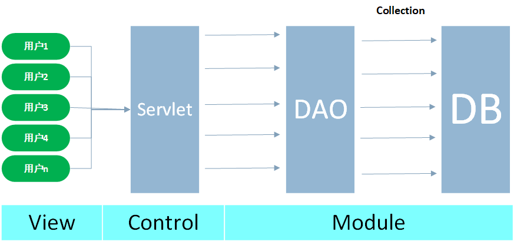
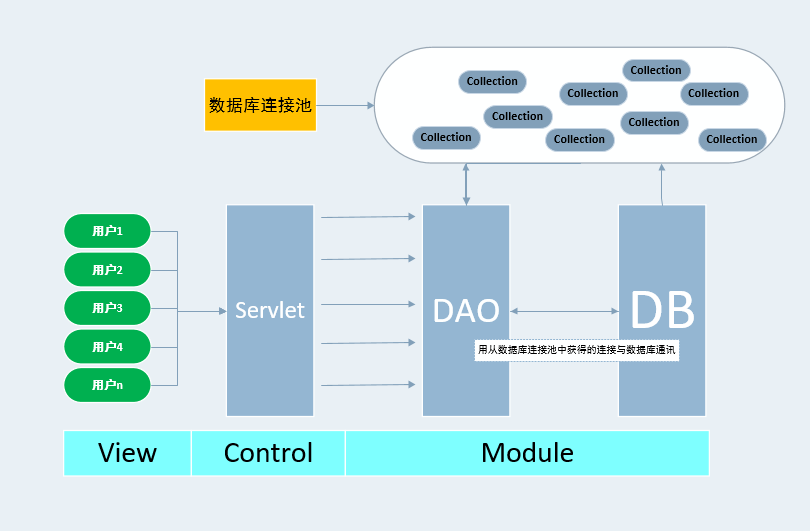

### 一、传统的数据库连接方式

以**MVC设计模式**为例



- 用户每一次请求模型层都要惊醒数据库的连接一个销毁操作
  - 1、加载驱动
  - 2、连接数据库
  - 3、执行SQL语句
  - 4、断开连接
  - **数据库创建连接需要较大的资源，消耗的世间也较长，所以当请求较多时频繁创建连接已不再合理，而且也可能造成数据库内存溢出。**

### 二、数据库连接池的概念

####1、数据库连接池的基本概念

- 提供一个装有已创建好的连接的容器-**数据库连接池**。

  

- 可以对其进行部分初始化参数配置，主要包括
  - **最小连接数：**连接池中含有的最小连接数，所以请求较少时，资源浪费比较严重
  - **最大连接数：**是连接池能申请的最大连接数，当请求过多时，后面的请求将会被加入到等待队列中，影响这次请求对数据库的操作。
  - **最小连接数与最大连接数相差较大时：**最先连接请求将会获得连接池中的连接，超过连接池的最小连接数之后的请求等价于创建一个新的连接，该连接使用 完之后不会立即被销毁，而是被放入连接池中，实现动态扩充连接池。  
- 数据库连接池中出含有已创建的连接外，还可以**动态地创建连接**。

#### 2、编写数据库连接池

- **编写数据库连接池要实现java.sql.DataSource接口**。DataSource接口中定义了两个重载的方法

  - Connection getConnection()
  - Connection getConnection(String username,String password)

- 实现DataSource几口，并实现连接池功能的步骤

  - 1、在DataSource构造函数中批量创建与数据库的连接，并把创建的连接加入的集合对象中（LinkedList）
  - 2、实现getConnection()方法，让getConnection()方法每次调用时，从LinkedList中去一个连接给用户
  - 3、当使用完Connection后调用Connection.close()方法，Connection对象应保证自己回到LinkedList中，而不是还给数据库。

- 核心代码

  - 读取数据库的配置文件信息

  > ```java
  > properties.load(JdbcPool.class.getClassLoader().getResourceAsStream("db.properties"));
  > ```
  >
  > 等价于
  >
  > ```java
  > InputStream inputStream= JdbcPool.class.getClassLoader().getResourceAsStream("db.properties");
  >         properties.load(inputStream);
  > ```
  >
  > - ```java
  >   	//使用反射获得Class实例
  >   	JdbcPool.class
  >           
  >       //通过getClassLoader()方法返回类的加载类 
  >           //Returns the class loader for the class 
  >   	    public ClassLoader getClassLoader() 
  >           
  >           //返回指定资源的输入流 Returns an input stream for reading the 					//specified resource.
  >               public InputStream getResourceAsStream(String name) 
  >           
  >           //读取输入流，输入流是一种面向行的格式
  >           /*Reads a property list (key and element pairs) from the input
  >        * byte stream. The input stream is in a simple line-oriented
  >        * format as specified in*/
  >       public synchronized void load(InputStream inStream) throws IOException
  >   ```
  >
  > - 

  - 使用动态代理技术构件连接池中的Connection

  > ```java
  >     @Override
  >     public Connection getConnection() throws SQLException {
  >         if (listConnections.size() > 0) {
  >             final Connection connection = listConnections.removeFirst();
  >             System.out.println("listConnections数据库连接池大小为：" + listConnections.size());
  >             //返回Connection对象的代理对象
  >             return (Connection) Proxy.newProxyInstance(JdbcPool.class.getClassLoader(), connection.getClass().getInterfaces(), new InvocationHandler() {
  >                 @Override
  >                 public Object invoke(Object proxy, Method method, Object[] args) throws Throwable {
  >                     if (!method.getName().equals("close")) {
  >                         return method.invoke(connection, args);
  >                     } else {
  >                         listConnections.add(connection);
  >                         System.out.println(connection + "被还给listConnections数据库连接池了！！！");
  >                         System.out.println("listConnections数据库连接池大小为：" + listConnections.size());
  >                     }
  >                     return null;
  >                 }
  >             });
  >         } else {
  >             throw new RuntimeException("对不起，数据库忙！！！");
  >         }
  >     }
  > ```
  >
  > - **Proxy类：**
  >
  >   ```java
  >   /*provides static methods for creating dynamic proxy
  >   * classes and instances, and it is also the superclass of all
  >   * dynamic proxy classes created by those methods.
  >   提供了动态代理类和实例的方法，它也是有这些方法小行家的所有动态代理类的超类
  >   */
  >   ```
  >
  > - ```java
  >        /**
  >        * Returns an instance of a proxy class for the specified interfaces
  >        * that dispatches method invocations to the specified invocation
  >        * handler.
  >        *返回指定接口的代理类的实例，该接口将方法调用分派给指定的调用处理程序。 
  >        * @param   loader        the class loader to define the proxy class
  >        *类加载器来定义代理类 
  >        * @param   interfaces       the list of interfaces for the proxy class
  >        *          to implement 代理类实现的接口列表 
  >        * @param   h  		the invocation handler to dispatch method 			 *invocations to 调度方法调用的调用处理函数 
  >        **/
  >       public static Object newProxyInstance(ClassLoader loader,
  >                                             Class<?>[] interfaces,
  >                                             InvocationHandler h)
  >   ```
  >
  > - ```java
  >   package java.lang.reflect;
  >   
  >   /**
  >    * is the interface implemented by
  >    * the <i>invocation handler of a proxy instance.
  >    */
  >   public interface InvocationHandler {
  >   
  >       /**
  >        * Processes a method invocation on a proxy instance and returns
  >        * the result.  This method will be invoked on an invocation handler
  >        * when a method is invoked on a proxy instance that it is
  >        * associated with.
  >        *
  >        * @param   proxy the proxy instance that the method was invoked on
  >        *
  >        * @param   method the {@code Method} instance corresponding to
  >        * the interface method invoked on the proxy instance.  The declaring
  >        * class of the {@code Method} object will be the interface that
  >        * the method was declared in, which may be a superinterface of the
  >        * proxy interface that the proxy class inherits the method through.
  >        *
  >        * @param   args an array of objects containing the values of the
  >        * arguments passed in the method invocation on the proxy instance,
  >        * or {@code null} if interface method takes no arguments.
  >        * Arguments of primitive types are wrapped in instances of the
  >        * appropriate primitive wrapper class
  >        *
  >        * @return  the value to return from the method invocation on the
  >        * proxy instance.  If the declared return type of the interface
  >        * method is a primitive type, then the value returned by
  >        * this method must be an instance of the corresponding primitive
  >        * wrapper class; otherwise, it must be a type assignable to the
  >        * declared return type.  If the value returned by this method is
  >        * {@code null} and the interface method's return type is
  >        * primitive, then a {@code NullPointerException} will be
  >        * thrown by the method invocation on the proxy instance.  If the
  >        * value returned by this method is otherwise not compatible with
  >        * the interface method's declared return type as described above,
  >        * a {@code ClassCastException} will be thrown by the method
  >        * invocation on the proxy instance. 
  >        */
  >       public Object invoke(Object proxy, Method method, Object[] args)
  >           throws Throwable;
  >   }
  >   ```

  

###三、开源数据库连接池

#### 1、C3P0数据源


####2、DBCP数据源


###四、配置Tomcat数据源

